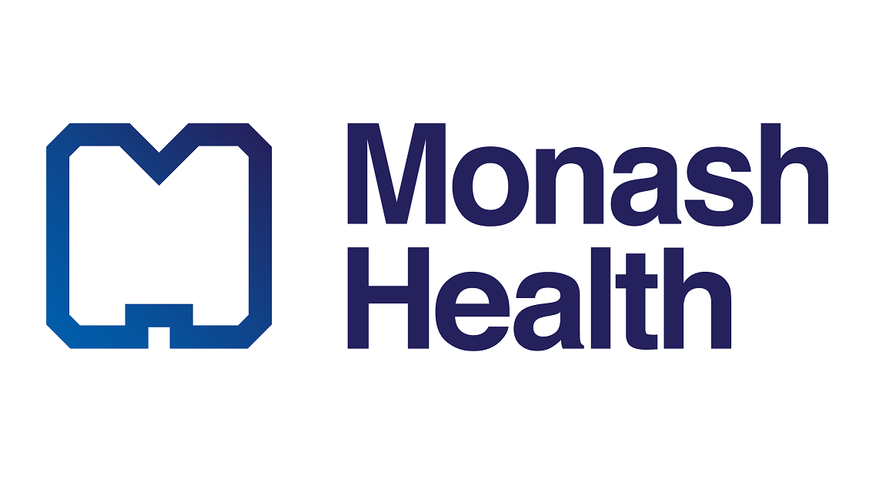

# Position Description for Community Advisory Committee Member

| Position Title | Community Advisory Committee Member                                                                                                                                                                                                                                                                                                                              |
| -------------- | ---------------------------------------------------------------------------------------------------------------------------------------------------------------------------------------------------------------------------------------------------------------------------------------------------------------------------------------------------------------- |
| Accountability | SHINE Project Team                                                                                                                                                                                                                                                                                                                                               |
| Support        | This is a voluntary position and is supported by the Community Involvement Coordinator.                                                                                                                                                                                                                                                                          |
| Reimbursement  | If a member accepts an honorarium, they will be paid $50 an hour for attending meetings and carrying out other related activities. This honorarium can be paid as a voucher, charity donation, etc. Out-of-pocket expenses (e.g. travel, home office set-up, child care expenses) and Consumer and Community Involvement training is covered but will be capped. |
| Membership     | Members can withdraw their membership at any time and there is no need to provide a reason. Prior notice would be appreciated. Memberships are on 1-year terms, and can be renewed by mutual agreement between the advisory member and SHINE project.                                                                                                                                                                                                                                                                                                            |
| Contact        | Cornelia Wellecke (SHINE Community Engagement Lead)                                                                                                                                                                                                                                                                                                                                                                  |
 

### Sleep Health in Perinatal Care (SHINE) ⭐
SHINE is a large collaborative project amongst Monash University (Lead), Stanford University (USA), Monash Health, and the Royal Women's Hospital. It is funded by Australian government (National Health and Medical Research Council) to study changes in sleep and wellbeing across pregnancy and the postpartum years, and to evaluate interventions for improving sleep during this important period for Australian families.

We are seeking consultations and advice from community members with lived experiences of being a new parent as well as health care professionals supporting new parents. These members of the community will form the Community Advisory Committee, and  play important roles throughout this project, including the initial development of the project, how it's carried out, and how findings are disseminated.

---

### Community Advisory Committee’s role 🧑‍🤝‍🧑
The following provides an overview of the tasks involved in the Community Advisory Committee:

**Completing training on consumer and community involvement**
- Orientation will be provided at the commencement of a membership term.

**Participating in committee meetings**:
- There will be 4-6 meetings during the first year, and about 2 meetings each subsequent year. Additional ad hoc meetings may be scheduled as well.
- The Community Involvement Coordinator will distribute an agenda before meetings and facilitate the meetings. Members are welcome to suggest changes to the agenda.
- Committee members will be requested to familiarise themselves with the agenda and supporting documents prior to meetings.
- During the meetings, members will have the opportunity to provide their expertise and input on various stages of the intervention project, for example:
	- the development and design of the intervention
	- the design of research processes
	- the evaluation of research outcomes
	- how findings are provided to the community
- Meetings will be audio-taped for accurate minute taking. Minutes will only be circulated internally. Minutes will not be used outside of the team unless members approve.
- If a member is uncomfortable with audio-taping, they can opt-out of their content being used in minutes.
- Members can take breaks anytime and opt out from participating in certain agenda items or topics.

**Providing feedback**
- Provide feedback on written materials of the research project, for example, questionnaires, consent forms.

---

### SHINE Project Team responsibilities ✅
- To consult with the Community Advisory Committee in relation to key aspects of the intervention project.
- To provide agenda and supporting documents one week prior to meetings.
- To set clear expectations on what stage the project is being advised on and whether certain aspects of the project can be changed prior to meeting discussions.
- To give regular and specific feedback to members on how their advice was used in the project.
- To ensure members have ongoing support and training in their role.

___

### Who should apply? 🔍
You can apply for the position if you are:
- Aged 18 years or older.
- Have lived experience of being a new parent or being a health care staff providing support for new parents. 
- Are able to attend online meetings.

Previous experience in contributing knowledge and expertise of consumer, carer and community perspectives (e.g. in advisory groups, improvement projects and community engagement) is desirable but not required.

---

### How can I apply? ✏️
To express your interest in the role, please follow this [link](https://monash.az1.qualtrics.com/jfe/form/SV_6VTnmjSgSlsJI58).

___

   

![[monash.png|190x100]]  ![[Monash_health.png|190x100]] ![[Stanford.png|210x100]] 
![[Royal-Womens-Hospital.png|220x100]]

